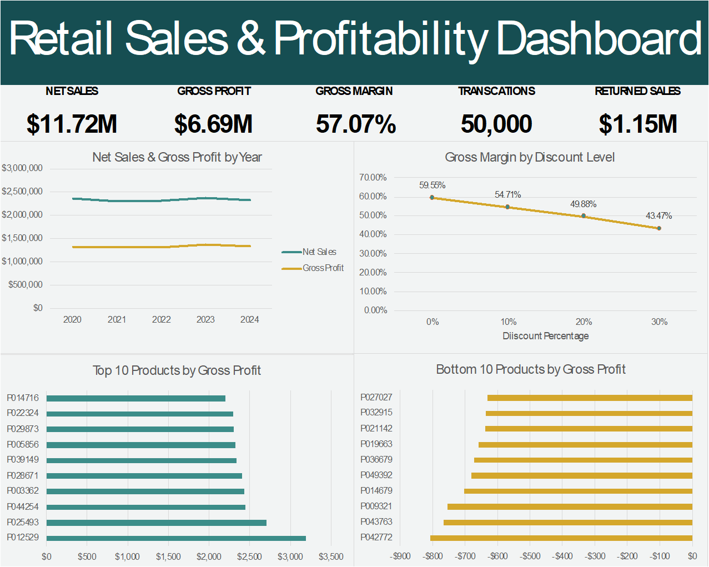

# Retail Sales & Profitability Analysis

An end-to-end Excel project analyzing 50,000 retail transactions across sales, product, customer, and store data. The project covers data cleaning, validation, multi-table integration, metric development, exploratory data analysis, and dashboard reporting.

## Dashboard Preview

## Project Overview

The objective of this project was to transform a messy multi-table retail dataset into a validated, analysis-ready dataset and use it to evaluate sales and profitability performance.

The workflow included:

- Auditing and cleaning four related datasets
- Validating IDs, missing values, formats, and relationships between tables
- Handling unmatched records without discarding otherwise usable transactions
- Reconstructing missing values only when a deterministic relationship could be validated
- Joining product, store, and customer attributes into a transaction-level analysis table
- Engineering sales and profitability metrics
- Performing exploratory analysis with PivotTables
- Building a final Excel dashboard to communicate key findings

## Dataset

The project uses the **Messy Retail Fashion Data** dataset from Kaggle.
**Source:** [Messy Retail Fashion Data — Kaggle](https://www.kaggle.com/datasets/vanpatangan/retail-fashion-data)

The data consists of four related tables:

- **Sales:** 50,000 transactions
- **Products:** 50,000 product records
- **Customers:** 25,000 customer records
- **Stores:** 5 store records

The sales table serves as the central transaction table, with product, customer, and store IDs linking to the supporting tables.

## Tools & Excel Skills

- Microsoft Excel
- XLOOKUP
- PivotTables and PivotCharts
- Excel formulas and logical functions
- Data validation and reconciliation
- Conditional formatting
- Multi-table relationship checks
- Calculated business metrics
- Dashboard design and visualization

## Data Cleaning & Validation

### Sales Data

Validated transaction IDs, dates, product IDs, store IDs, customer IDs, quantities, discounts, and return indicators.

Key issues identified included:

- **200 transactions** referencing a product ID not found in the product table
- **200 transactions** referencing a store ID not found in the store table
- **1,844 transactions** with missing customer IDs
- **2,583 transactions** with unknown discounts

Relationship status fields were created to distinguish matched and unmatched records while retaining transactions that remained useful for other analyses.

Missing discounts were not assumed to be zero because zero was already an explicit discount value in the dataset. Repeated product IDs were also examined and shown to have different discounts across transactions, indicating that discount was transaction-specific and could not reliably be reconstructed from product ID.

### Product Data

Validated product IDs and standardized product attributes.

Cleaning included:

- Replacing **499 `???` category values** with `Unknown`
- Replacing **990 missing color values** with `Unknown`
- Validating cost and list prices
- Identifying **8,582 products** where list price was below cost price

These below-cost records were retained because there was insufficient evidence to classify them as data errors, allowing their effect on profitability to be analyzed.

### Customer Data

Validated customer IDs, ages, gender values, cities, and email addresses.

Cleaning included:

- Replacing **298 `???` gender values** with `Unknown`
- Identifying **496 missing email addresses**
- Discovering a deterministic relationship between customer ID and email address
- Validating the relationship against every populated email record
- Reconstructing all 496 missing emails only after confirming the pattern

### Store Data

Validated all five store records for completeness, consistency, and reasonable store-size values.

## Data Integration

A consolidated transaction-level **Sales Analysis** table was created using XLOOKUP.

Product attributes joined to sales included:

- Category
- Color
- Size
- Season
- Supplier
- Cost price
- List price

Store attributes included:

- Store name
- Region
- Store size

Customer attributes included:

- Age
- Gender
- City

Unmatched relationships were represented as `N/A`, while `Unknown` was reserved for attributes belonging to matched records whose original value was missing or ambiguous.

## Calculated Metrics

The analysis table includes several derived business metrics:

- **Gross Sales** = List Price × Quantity
- **Discount Amount** = Gross Sales × Discount
- **Net Sales** = Gross Sales − Discount Amount
- **Product Cost** = Cost Price × Quantity
- **Gross Profit** = Net Sales − Product Cost
- **Gross Margin %** = Gross Profit ÷ Net Sales
- **Returned Sales** = Net Sales associated with transactions flagged as returned

Returned sales were kept separate rather than automatically deducted from revenue because the dataset does not specify refund timing, partial versus full returns, or cost reversals.

## Exploratory Analysis

PivotTable analysis was performed across multiple business dimensions, including:

- Yearly sales and profitability
- Category and season performance
- Supplier profitability
- Top and bottom products by gross profit
- Top customers by spending
- Store performance
- Returns by product category
- Discount level and profitability

## Key Findings

### Overall Performance

Across the five-year dataset:

- **Net Sales:** approximately **$11.72M**
- **Gross Profit:** approximately **$6.69M**
- **Aggregate Gross Margin:** **57.07%**
- **Transactions:** **50,000**
- **Returned Sales:** approximately **$1.15M**

Annual sales and gross profit remained relatively stable from 2020 through 2024.

### Discounts and Profitability

Aggregate gross margin declined consistently as discount levels increased:

| Discount | Aggregate Gross Margin |
|---|---:|
| 0% | 59.55% |
| 10% | 54.71% |
| 20% | 49.88% |
| 30% | 43.47% |

Higher discount levels therefore corresponded with progressively lower aggregate gross margins in this dataset.

### Product Profitability

Product-level analysis revealed meaningful differences despite relatively stable performance at broader category and store levels.

The **10 least profitable products** generated approximately:

- **$1.9K in net sales**
- **-$6.9K in gross profit**

This finding complements the earlier identification of **8,582 products with list prices below cost**, highlighting product-level pricing and profitability as an important area for further investigation.

## Data Quality & Reconciliation

Validation checks were used throughout the project to ensure calculations remained consistent after cleaning and transformation.

During metric validation, an unexpected change in the number of unavailable cost values exposed an accidentally overwritten product cost. The source record was traced, restored, and the affected counts were reconciled before analysis continued.

This reinforced the use of validation totals and reconciliation checks throughout the workflow rather than relying only on successful formulas.

## Project Files

- **`Retail_Sales_Profitability_Analysis.xlsx`** — complete Excel workbook containing cleaned data, validation work, joined analysis data, PivotTables, calculations, and dashboard
- **`retail_sales_dashboard.png`** — preview of the final dashboard

## Dashboard

The final dashboard summarizes:

- Net sales
- Gross profit
- Gross margin
- Transaction volume
- Returned sales
- Annual sales and profit performance
- Gross margin across discount levels
- Top 10 products by gross profit
- Bottom 10 products by gross profit
